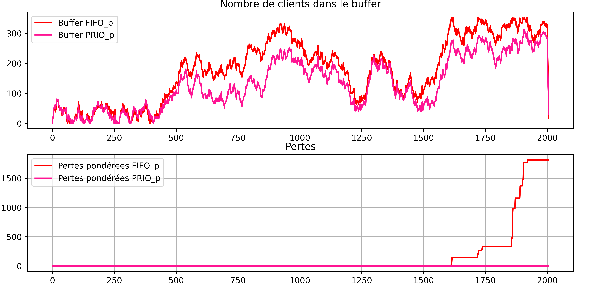

# Modélisation mathématique et informatique des files d’attente
La théorie des files d'attentes est un domaine d'étude relativement récent dans son étude et dont les applications sont nombreuses : magasins ou bien systèmes informatiques. Les questions d'optimisation les concernant sont nombreuses et leur modélisation peut permettre d'accéder à une compréhension plus fine de ces files d'attente.

Hôpitaux, réseaux informatiques, magasins : la notion de file d'attente est générale à s'applique à de nombreux domaines et sont des enjeux sociétaux dont l'étude est nécéssaire à la société, pouvant permettre une meilleure utilisation des ressources à l'aide des différentes optimisations possibles.

### Ce TIPE fait l'objet d'un travail de groupe.
Liste des membres du groupe :
 - CHAMPIN Camil

*Support pour la démonstration de la loi de Little dans le cas FIFO*

*Exemple de simulation : comparaison d'une file FIFO avec une file PRIO*

## Positionnement thématique (ETAPE 1)
 MATHEMATIQUES (Mathématiques Appliquées), INFORMATIQUE (Informatique pratique).

## Mots-Clés (en français) - Mots-Clés (en anglais)
- Théorie des files / Queueing theory
- Processus stochastique / Stochastic process
- Simulation / Simulation
- Probabilités / Probality
- Prévision / Forcast

## Bibliographie commentée
La théorie des files d'attente prend son essor au tout début du XXème siècle, lorsque Agner Krarup Erlang décide d'étudier le système téléphonique de Copenhague. Elle se développe tout particulièrement dans au milieu du siècle : en 1953, David George Kendall introduit une notation qui évoluera pour décrire dans son intégralité un système de file d'attente, et qui est toujours utilisée de nos jours (C.f. [1], [2]). Il utilise des outils des outils probabilistes récents comme les chaines de Markov ([3], [4]) pour décrire précisément le comportement de ces systèmes. En 1954, John Little intuite ses célèbres lois, qui relient la taille moyenne de la file au temps d'attente moyen des clients. Il faut alors attendre 1961 pour la première démonstration, et 1972 pour une autre, plus élégante, due à Shaler Stidham.

Depuis la révolution numérique, la mise en place de réseaux informatiques fait de plus en plus appel à la théorie des systèmes d'attente. Pour cette raison, de nombreux travaux cherchent à développer la théorie des files et à mettre en valeur leur application en informatique ([1]). Par ailleurs, nombreux cursus traitent aujourd'hui de la théorie des files, et de ses applications dans l'analyse du travail ([2]).

Les files d'attentes les plus courantes font intervenir des processus d'arrivée et de sortie aléatoires correspondant à des processus de Poisson. L'étude de tels systèmes mène à plusieurs résultats sur le comportement asymptotique du système, mais l'existence même d'états stationnaires est encore assez obscure, pour citer [3]. La simulation permet donc d'émettre des hypothèses et des preuves empiriques.

Pourtant, les rares bibliothèques Python permettant de modéliser des systèmes d'attente sont souvent assez limitées.

## Problématique retenue
Comment simuler informatiquement les différents modèles de files d'attente et analyser leur comportement en fonction du régime d'arrivées. Choix de la discipline de service.

## Objectifs du TIPE
Création d'une bibliothèque Python permettant l'étude du comportement de différents types de files d'attente. Étude de l'influence des différents paramètres et des différents avantage des files selon la discipline choisie. Cette bibliothèque a pour but d'être le plus flexible possible et de permettre la compréhension d'une grande variété de files. Relier résultats du modèle informatique aux résultats de la théorie mathématique. Différences entre comportement asymptotique et régime transitoire.

## Références bibliographiques (ETAPE 1)
- [1] __Leonard Kleinrock__ : “Queueing Systems, Volume I: Theory” : *Wiley Interscience, 1975, ISBN-10 : 9780471491101*
- [2] __Dimitri Bertsekas, Robert Gallager__ : “Data Networks” : *Chapitre 3 : “Queueing”, Pearson, 1992, ISBN-10 : 0132009161*
- [3] __Jacques Bair, Yves Crama, Valérie Henry, Daniel Justens__ : “Modèles mathématiques en gestion” : *Vuibert, 2011, ISBN-10 : 2842251504*
- [4] __Arthur Engel__ : “Processus aléatoires pour les débutant” : *Vuibert, 2011, ISBN-10 : 2842250907*

## DOT

- [1] Étude documentaire de la théorie mathématique des files d’attente : problème de réflexion, notation de Kendall, loi de Little et démonstration en service FIFO, comportements asymptotiques…

- [2] Premières simulations rudimentaires de files d’attente. Vérification expérimentale du problème de réflexion

- [3] Abandon du premier modèle, trop limité. Création d’un nouveau modèle orienté objet, basé sur la simulation instantanée et discrète de la file. Ce modèle a pour ambition d’être le plus flexible possible, quitte à perdre en optimisation.

- [4] Le nouveau modèle est très flexible et permet l'étude de nombreux résultats et l'influence des différents paramètres en régime transitoire.

- [5] Création d'une base de donnée pour stocker les résultats de nombreuses simulations. Analyse des nouveaux résultats obtenus : vérification de la loi de Little, probabilité de perte...

- [6] Études de différentes disciplines de service : Round Robin, "Caisse moins de dix articles".

- [7] Étude expérimentale d'une file réelle : file d'attente du self du lycée.

CHAMPIN Camil

THOMAS Gauvain

La Martinière Monplaisir - MP / MP*
