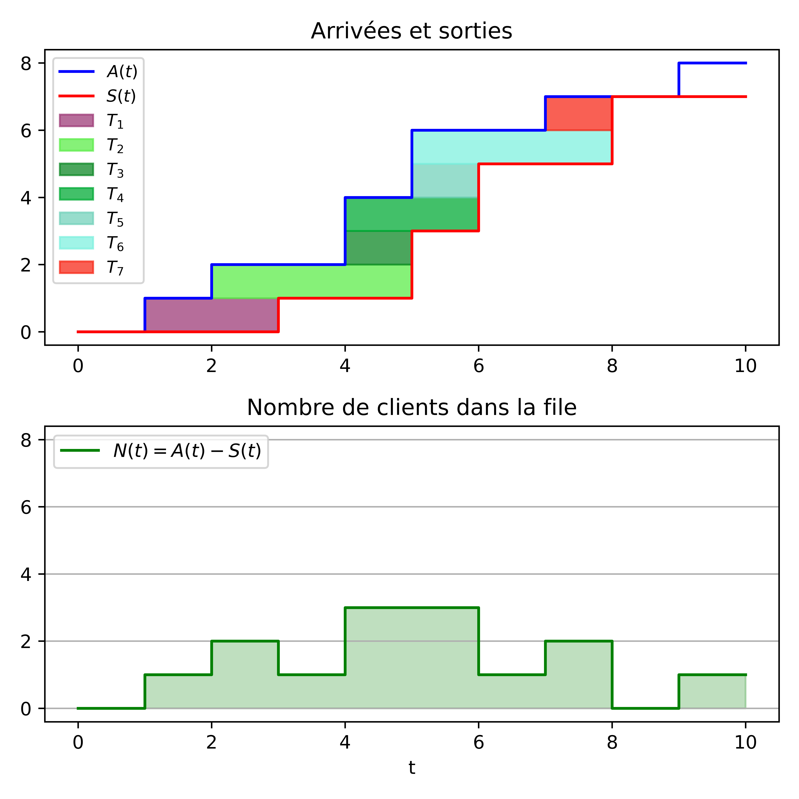

# TIPE Files
Un TIPE sur les files d'attente, leur représentation mathématique ainsi que leur simulation informatique.

Deux branches coexistent et présentent deux implémentations différentes des modélisation :

- [Simulation instantanée](https://github.com/Squidoss/TIPE-Files/tree/simul_intstant) : Une simulation instant par instant permettant l'analyse des comportements en régime transitoire.

- [Simulation par évènements](https://github.com/Squidoss/TIPE-Files/tree/simul_evenement) :

CHAMPIN Camil

THOMAS Gauvain

La Martinière Monplaisir - MP / MP*
